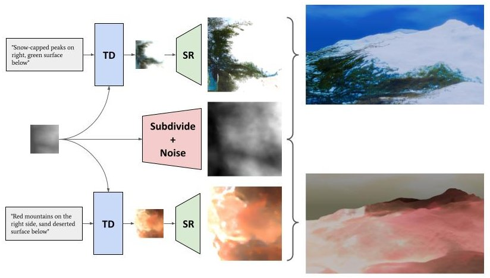

# TerrainDiffuser

**TerrainDiffuser** is a generative AI framework that enables **dynamic texture generation for 3D terrains** by leveraging **text prompts** and **elevation data**. Traditional terrain generation workflows often require manual sculpting and texturing, which can be time-consuming. TerrainDiffuser streamlines this process by generating high-quality, semantically consistent terrain textures directly from **digital elevation maps (DEMs) and textual descriptions**. This makes it a powerful tool for **game development, simulation environments, and rapid prototyping**.

 

## Key Features

- 🚀 **Text-Guided Terrain Texturing** – Generates terrain textures conditioned on user-provided text prompts (e.g., *"snowy peaks with a dense forest below"*).
- 🏔 **Elevation-Aware Generation** – Ensures that textures are consistent with the terrain's height map, maintaining realism and structural coherence.
- 🔄 **Flow Matching-Based Approach** – Utilizes **flow matching and multi-scale feature conditioning** to balance geometric constraints with artistic flexibility.
- 🖼 **Super-Resolution Post-Processing** – Enhances generated textures using **SwinIR** to upscale outputs for **high-resolution 3D rendering**.

## Model Overview

The following diagram illustrates the **overall pipeline** of TerrainDiffuser, from input elevation maps and text prompts to the final rendered 3D terrain. 3D rendering of the result is done using _Blender_.

 

## Applications

- 🎮 **Game Development** – Rapidly prototype realistic terrain textures from simple sketches and text inputs.
- 🌍 **Simulation & GIS** – Generate accurate terrain representations for geospatial analysis.
- 🎨 **Procedural Content Creation** – Automate terrain design workflows for large-scale virtual environments.

## Installation

Coming soon...

## Acknowledgement

This work was conducted as part of Project Research A at Simo-Serra Laboratory, Waseda University.
